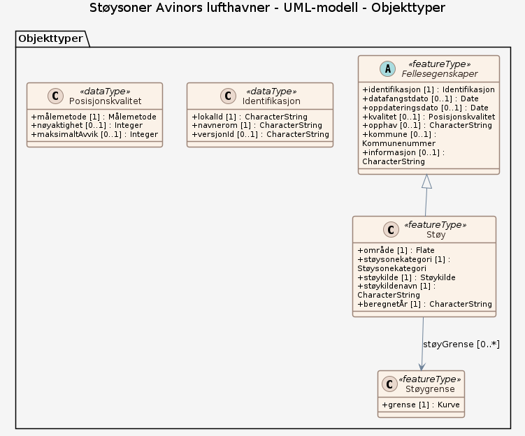

# Produktspesifikasjon: Støysoner Avinors lufthavner

*Datasettet gir opplysninger om støy i innflyvningssoner og støy ved bakken i tilknytning til flyplasser. Støysoner er behandlet iht. T-1442 Retningslinjer for behandling av støy i arealplanlegging, Miljøverndepartementet*

**Nøkkelord:** Støysoner, Lufthavner, Flyplass, Avinor, Norge, Rapporteringsenheter og områder med særlig forvaltning eller restriksjoner, Inspire, Det offentlige kartgrunnlaget, Norge digitalt, geodataloven, modellbaserteVegprosjekter, fellesDatakatalog, Forurensning

**Emnekategorier:** Miljødata

**Geografisk utstrekning**:

- **Vest**: 2.0
- **Øst**: 33.0
- **Sør**: 57.0
- **Nord**: 72.0

**Tidsmessig utstrekning**:

- **Tidsperiode**:
  - **Fra**: 2014-04-07
  - **Til**: 2025-01-17

## Om spesifikasjonen

> **Denne versjonen av produktspesifikasjonen:**  
> **Opprettet dato:** 2014-04-07 
> **Endret dato:** 2025-01-17 
> **Språk:** nor 
> **Kontaktinformasjon:** Avinor, [Jan.Anders.Marheim@avinor.no](mailto:Jan.Anders.Marheim@avinor.no)

## Om produktet Støysoner Avinors lufthavner

> **Romlig representasjonstype:** Vektor 
> **Unik identifikator:** <https://data.geonorge.no/sosi/forurensning/stoysoner_lufthavn> 
> **Kontaktinformasjon:** Avinor, [Jan.Anders.Marheim@avinor.no](mailto:Jan.Anders.Marheim@avinor.no)
>
> **Romlig oppløsning:**
>
> **Ekvivalent målestokk**: 5000
>
> **Begrensninger:**
>
> **Ressursbegrensninger**:
>
> - **Bruksbegrensninger**: Ingen
>
> **Juridiske begrensninger**:
>
> - **Tilgangsbegrensninger**: Åpne data
> - **Bruksbegrensninger**: Lisens
> - **Lisens**: No conditions apply to access and use
> - **Lisenslenke**: <http://inspire.ec.europa.eu/metadata-codelist/ConditionsApplyingToAccessAndUse/noConditionsApply>
> - **Andre begrensninger**: Ingen begrensninger oppgitt.
>
> **Sikkerhetsbegrensninger**:
>
> - **Klassifisering**: Ugradert

### Bruksområde

Datasettet gir opplysninger om støy i innflyvningssoner og støy ved bakken i tilknytning til flyplasser. Støyberegningene skal ikke benyttes sammen med detaljerte kartdata

## Omfang

### Hele datasettet

**Nivå**: dataset

**Nivåbeskrivelse**: Gjelder hele datasettet. Hvis omfang ikke er oppgitt under en overskrift, gjelder teksten for hele datasettet og alle leveranser

### UML-modell

**Nivå**: dataset

## Datainnhold og struktur

### Datamodell - UML-modell

➡️ [Se full datamodell for omfang "UML-modell" (diagram per pakke og objektkatalog)](uml-modell/objektkatalog.html)

## Referansesystem

| EPSG-kode | Navn på referansesystem |
| --- | --- |
| [EPSG:25832](https://epsg.io/25832) | [EUREF89 UTM sone 32, 2d](https://register.geonorge.no/epsg-koder) |
| [EPSG:25833](https://epsg.io/25833) | [EUREF89 UTM sone 33, 2d](https://register.geonorge.no/epsg-koder) |
| [EPSG:25835](https://epsg.io/25835) | [EUREF89 UTM sone 35, 2d](https://register.geonorge.no/epsg-koder) |
| [EPSG:3035](https://epsg.io/3035) | [EUREF89 / ETRS89-LAEA Europe](https://register.geonorge.no/epsg-koder) |
| [EPSG:4258](https://epsg.io/4258) | [EUREF 89 Geografisk (ETRS 89) 2d](https://register.geonorge.no/epsg-koder) |

## Datakvalitet

**Nivå**: dataset

**Kvalitetsmål**: COMMISSION REGULATION (EU) No 1089/2010 of 23 November 2010 implementing Directive 2007/2/EC of the European Parliament and of the Council as regards interoperability of spatial data sets and services

- **Beskrivende resultat**: Dataene er ikke vurdert iht produktspesifikasjonen

**Kvalitetsmål**: SOSI-produktspesifikasjon: Støy med veiledningsmateriale

- **Beskrivende resultat**: Dataene er i henhold til produktspesifikasjonen

**Kvalitetsmål**: Sosi applikasjonsskjema

- **Beskrivende resultat**: SOSI-filer er i henhold til applikasjonsskjema

**Kvalitetsmål**: Sosi applikasjonsskjema

- **Beskrivende resultat**: GML-filer er i henhold til applikasjonsskjema

**Kvalitetsmål**: Prosentvis oppfyllelse av FAIR-prinsipper

- **Målebeskrivelse**: Angir fullstendighet i forhold til krav fra FAIR-prinsippene (The FAIR Guiding Principles for scientific data management and stewardship)
- **Resultat**: 96

## Datafangst og produksjon

**Datainnsamling og prosessering**:

- **Prosesstrinn**:
  - **Beskrivelse**: SINTEF har utviklet en støyberegningsmodell for Forsvaret og Avinor. Modellen beregner støy i innflyvningssoner og støy ved bakken, både maksimalstøy og gjennomsnittsverdier. Det er krav til støyberegninger hvert 10 år eller ved store endringer i flytrafikken. Ofte gjøres beregninger hvert 4. år i forbindelse med revisjon av kommunedelplaner. Datasettet gir opplysninger om støysoner rød og gul sone som gir forskjellige begrensninger for arealbruk i henhold til "Retningslinje for behandling av støy i arealplanlegging (T-1442)". Leverandør vil være Forsvarsbygg og Avinor.

## Vedlikehold

**Vedlikeholdsfrekvens**: Hvert halvår

**Status**: Kontinuerlig oppdatert

## Presentasjon

**navn**: Tegneregler

**Lenke**:
<https://register.geonorge.no/register/versjoner/tegneregler/avinor/stoysoner>

## Leveranse

| Tjeneste | Endepunkt | Type | Format | Leveranseenheter |
| --- | --- | --- | --- | --- |
| Geonorge nedlastning | [Lenke](https://nedlasting.geonorge.no/api/capabilities/) | GEONORGE:DOWNLOAD | FGDB, GML, SOSI | fylkesvis, kommunevis, landsfiler |
| Atom Feed | [Lenke](http://nedlasting.geonorge.no/geonorge/ATOM-feeds/Flystoydata_AtomFeedFGDB.xml) | W3C:AtomFeed | FGDB | fylkesvis, kommunevis, landsfiler |
| Atom Feed | [Lenke](http://nedlasting.geonorge.no/geonorge/ATOM-feeds/Flystoydata_AtomFeedGML.xml) | W3C:AtomFeed | GML | fylkesvis, kommunevis, landsfiler |
| Atom Feed | [Lenke](http://nedlasting.geonorge.no/geonorge/ATOM-feeds/Flystoydata_AtomFeedSOSI.xml) | W3C:AtomFeed | SOSI | fylkesvis, kommunevis, landsfiler |
| Støysoner Avinors lufthavner WMS | [Lenke](https://wms.geonorge.no/skwms1/wms.stoylufthavn?service=wms&request=getcapabilities) | WMS-tjeneste | png |  |
| GeoPackage: uml-modell | [Lenke](https://raw.githubusercontent.com/ToreFreddyB/produktspesifikasjon_avinor/main/produktspesifikasjon/stoysoner-avinors-lufthavner/uml-modell/uml-modell.gpkg) | Nedlasting | GPKG |  |

## Metadata

**Metadatastandard**: ISO19115

**Metadatastandardversjon**: 2003

**Metadatadato**: 2026-09-16

**språk**: nor

**Kontakt**:

- **Organisasjon**: Avinor
- **Kontaktperson**: Mariann Nilssen
- **Logo**: <https://register.geonorge.no/data/organizations/985198292_Avinor_liten.png>
- **Epost**: Mariann.Nilssen@avinor.no
- **rolle**: pointOfContact

**Metadataidentifikator**:

- **Utsteder**: Geonorge
- **kode**: 1489f7f8-40c8-4dc4-83b6-bcf277b56506
- **koderom**: <https://kartkatalog.geonorge.no/metadata/>
- **Metadatalenke**: <https://kartkatalog.geonorge.no/metadata/1489f7f8-40c8-4dc4-83b6-bcf277b56506>

## Tilleggsinformasjon

- **Produktark:** [https://register.geonorge.no/register/versjoner/produktark/avinor/stoysoner](https://register.geonorge.no/register/versjoner/produktark/avinor/stoysoner)
- **Produktside:** [http://avinor.maps.arcgis.com/apps/Viewer/index.html?appid=d985928855be400d86b0eba4f617c764](http://avinor.maps.arcgis.com/apps/Viewer/index.html?appid=d985928855be400d86b0eba4f617c764)
